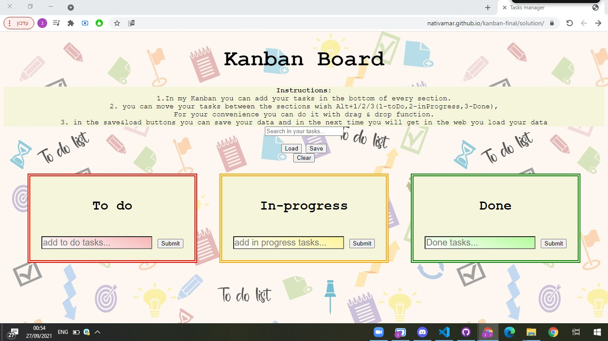

# Cyber4s 3rd Pre-Course Final Project- Nativ Amar

## What I'm build:
Welcome to my pre-course final project- a task-management application.
My GitHub pages link - https://nativamar.github.io/kanban-final/solution/ .

## Instructions
     1.In my Kanban you can add your tasks in the bottom of every section.   
     2. you can move your tasks between the sections wish Alt+1/2/3(1-toDo,2-inProgress,3-Done),
     For your convenience you can do it with drag & drop function.
     3. in the save&load buttons you can save your data and in the next time you will 
     get in the web you load your data.

### Page Structure

There is 3 `section` elements. One for to-do tasks, one for in-progress tasks, and one for done tasks.

Each `section` contain:

- [ ] a `ul` element with the appropriate class - `to-do-tasks`/`in-progress-tasks`/`done-tasks`
- [ ] an `input` element with an appropriate id - `add-to-do-task`/`add-in-progress-task`/`add-done-task`
- [ ] a `button` element with an appropriate id - `submit-add-to-do`/`submit-add-in-progress`/`submit-add-done`
- [ ] Each `ul` contain task elements, which are `li` elements with the `task` class.

### Interaction

- [ ] When the user clicks on one of the add-task buttons, a new task will be added to the respective list. The task content will be taken from the    respective input field.
- [ ] Trying to submit empty tasks should cause an alert.
- [ ] Double clicking a task element will enable the user to edit its text. When the task element loses focus the change will be saved.
- [ ] Hovering over a task element and pressing `alt + 1-3` will move your tasks to the appropriate list (`1`: todo, `2`: in-progress, `3`: done).
- [ ] The search input filter tasks case-**in**sensitively, so that only tasks that match the search string are displayed. The filter will be reapplied every time the user changes the content of the search input.
- [ ] you can move your tasks with drag&drop with your mouse. 
- [ ] you can save & load your tasks in the API with the save&load buttons. 

### Storage
your tasks are saven in your localStorage. you can save it in the API, and load it in your next visit.
